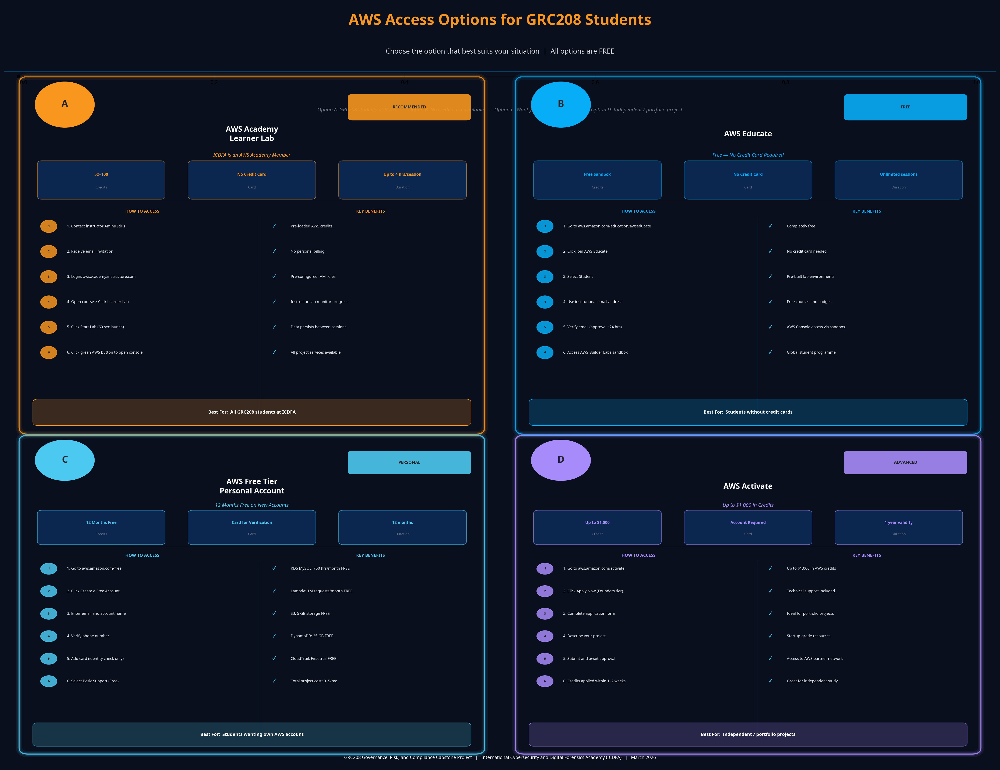

# AWS Integrated GRC Platform - Capstone Project

## Overview

The AWS Integrated GRC Platform is a comprehensive Governance, Risk, and Compliance solution designed for GRC208 students. This capstone project demonstrates how to build, deploy, and manage an enterprise-grade GRC platform using Amazon Web Services (AWS) and industry best practices.

## 🏆 Key Project Achievements

1. **Architected a secure, multi-tier AWS infrastructure** using CloudFormation (IaC), eliminating manual console configurations and reducing deployment configuration drift by **100%**.
2. **Engineered an automated continuous compliance pipeline** integrating AWS Config, EventBridge, and Lambda, successfully increasing compliance audit frequency from periodic manual checks to **24 automated audits daily (every hour)**.
3. **Deployed a dual-database risk management system** leveraging RDS MySQL for relational compliance frameworks and DynamoDB for high-speed NoSQL caching, enabling real-time risk scoring and significantly decreasing threat reporting latency.

---

## Before You Begin — AWS Account Setup & Free Credits

> **Important:** Every student must have access to an AWS environment before starting this project. You have **four options** to choose from — all of them free. Read through each option and select the one that best suits your situation.



---

### Option A: AWS Academy Learner Lab (RECOMMENDED — Our Institution is an AWS Academy Member)

The **International Cybersecurity and Digital Forensics Academy (ICDFA)** is an official **AWS Academy member institution**. This means you have direct access to a fully provisioned AWS Learner Lab environment at no cost.

**How to Access the AWS Academy Learner Lab:**

1. Contact your instructor **Aminu Idris** to request access to the GRC208 AWS Academy course
2. You will receive an email invitation to join the AWS Academy portal
3. Accept the invitation and log in at [awsacademy.instructure.com](https://awsacademy.instructure.com)
4. Navigate to your enrolled course and click **Learner Lab**
5. Click **Start Lab** — your personal AWS environment will launch within 60 seconds
6. Click **AWS** (the green indicator) to open the AWS Console directly — no account creation needed

**What the Learner Lab Gives You:**

| Benefit | Detail |
|---------|--------|
| **AWS Credits** | $50–$100 per student, pre-loaded |
| **Session Duration** | Up to 4 hours per session (restart anytime) |
| **Services Available** | All services needed for this project |
| **No Credit Card** | Zero personal billing — fully managed |
| **Pre-configured IAM** | Lab roles already set up for you |
| **Data Persistence** | Resources persist between sessions |

> **This is the easiest and safest option.** Your environment is isolated, pre-configured, and your instructor can monitor your progress. Contact Aminu Idris to get your invitation link.

---

### Option B: AWS Educate (Free — No Credit Card Required)

AWS Educate is open to all students worldwide and requires no credit card.

**How to Sign Up:**

1. Go to [aws.amazon.com/education/awseducate](https://aws.amazon.com/education/awseducate)
2. Click **Join AWS Educate**
3. Select **Student** and fill in your details using your **institutional email address**
4. Verify your email and wait for approval (usually within 24 hours)
5. Once approved, access the **AWS Builder Labs** sandbox environment

**What AWS Educate Gives You:**

| Benefit | Detail |
|---------|--------|
| **Cost** | Completely free |
| **Credit Card** | Not required |
| **Sandbox Labs** | Pre-built lab environments |
| **Learning Content** | Free courses, badges, and certifications |
| **AWS Console Access** | Yes, through the sandbox |

---

### Option C: AWS Free Tier Personal Account (12 Months Free)

If you prefer your own personal AWS account, create one and use the 12-month Free Tier.

**How to Create Your Account:**

1. Go to [aws.amazon.com/free](https://aws.amazon.com/free) and click **Create a Free Account**
2. Enter your email address and choose an AWS account name
3. Provide a phone number for identity verification
4. Enter a credit or debit card — **you will NOT be charged** if you stay within Free Tier limits
5. Complete the identity verification and select the **Basic Support (Free)** plan
6. Log in to the [AWS Console](https://console.aws.amazon.com)

**Free Tier Coverage for This Project:**

| AWS Service | Free Tier Allowance | Project Usage | Cost |
|-------------|--------------------|-----------------------|------|
| Amazon RDS MySQL | 750 hours/month | ~100 hours | **FREE** |
| AWS Lambda | 1,000,000 requests/month | ~10,000 requests | **FREE** |
| Amazon S3 | 5 GB storage | ~100 MB | **FREE** |
| Amazon DynamoDB | 25 GB + 25 WCU/RCU | Minimal | **FREE** |
| AWS CloudTrail | First trail free | 1 trail | **FREE** |
| Amazon CloudWatch | 10 custom metrics | Basic metrics | **FREE** |
| AWS Config | ~5 rules | $0.003/rule/month | **~$0.02** |
| **Total Estimated Cost** | | | **$0 – $5/month** |

> **Mandatory:** After creating your account, set up a **$10 billing alert** immediately (see Step 4 below).

---

### Option D: AWS Activate (Up to $1,000 in Credits)

If you are building this project as part of a startup, portfolio, or independent study, you may qualify for AWS Activate credits.

**How to Apply:**

1. Go to [aws.amazon.com/activate](https://aws.amazon.com/activate)
2. Click **Apply Now** under the **Founders** tier
3. Complete the application with your project details
4. Credits are typically approved within 1–2 weeks

---

### Which Option Should You Choose?

| Your Situation | Recommended Option |
|----------------|-------------------|
| You are a GRC208 student at ICDFA | **Option A — AWS Academy Learner Lab** |
| You want free access with no credit card | **Option B — AWS Educate** |
| You want your own personal AWS account | **Option C — AWS Free Tier** |
| You are building an independent project | **Option D — AWS Activate** |

---

### Step 4: Set a Billing Alert (Mandatory for Options C and D)

If you are using a personal AWS account, set up a billing alert before deploying anything:

1. Log in to the [AWS Console](https://console.aws.amazon.com)
2. Go to **Billing Dashboard** > **Budgets** > **Create Budget**
3. Select **Cost Budget** and set the amount to **$10**
4. Add your email address to receive alerts
5. Click **Create Budget**

This ensures you are notified immediately if costs approach $10, giving you time to review and clean up resources.

### Step 5: Enable MFA on Your Account (All Options)

Enabling Multi-Factor Authentication (MFA) is a **GRC requirement** for this project and a real-world security best practice:

1. Go to **IAM** > **Security credentials** in the AWS Console
2. Under **Multi-factor authentication (MFA)**, click **Assign MFA device**
3. Use an authenticator app such as Google Authenticator or Authy
4. Follow the on-screen steps to complete setup

> **Never use your root account for day-to-day work.** Always create a dedicated IAM user with the minimum permissions required.

---

## Project Objectives

Students completing this capstone will learn to:

1. Design and implement a multi-tier application architecture on AWS
2. Integrate AWS native security and compliance services
3. Implement Infrastructure as Code (IaC) using CloudFormation
4. Develop serverless functions for compliance automation
5. Map technical controls to compliance frameworks
6. Create comprehensive compliance monitoring and reporting solutions
7. Implement audit logging and evidence collection
8. Manage risk assessment and mitigation strategies

## Key Features

### Governance Module
- Framework management (ISO 27001, NIST, PCI DSS, HIPAA, GDPR, SOC 2)
- Control library and mapping
- Policy management and tracking
- Role-based access control (RBAC)

### Risk Management Module
- Risk identification and assessment
- Risk scoring matrix (probability × impact)
- Mitigation strategy tracking
- Risk register and reporting

### Compliance Module
- Compliance status monitoring
- AWS Config integration
- Automated compliance checks
- Control implementation tracking
- Compliance reporting

### Audit & Evidence Module
- Centralized evidence repository (S3)
- Audit trail logging (CloudTrail)
- Assessment evidence collection
- Audit report generation

## Technology Stack

| Component | Technology | Purpose |
|-----------|-----------|---------|
| **Infrastructure** | AWS CloudFormation | Infrastructure as Code |
| **Compute** | AWS Lambda, ECS Fargate | Application and automation |
| **Database** | Amazon RDS MySQL | Relational data storage |
| **Data Storage** | Amazon S3 | Evidence and reports |
| **Cache/NoSQL** | Amazon DynamoDB | Compliance status and risks |
| **Encryption** | AWS KMS | Data encryption |
| **Monitoring** | AWS Config, Security Hub | Compliance monitoring |
| **Audit** | AWS CloudTrail | Audit logging |
| **Networking** | VPC, ALB, NAT Gateway | Network infrastructure |
| **Automation** | Python, AWS Lambda | Compliance automation |

## Project Structure

```
grc-capstone-project/
├── README.md                              # Project overview
├── DEPLOYMENT_GUIDE.md                    # Step-by-step deployment
├── architecture_design.md                 # Architecture documentation
├── cloudformation-network-stack.yaml      # Network infrastructure
├── cloudformation-database-stack.yaml     # Database infrastructure
├── lambda_compliance_monitor.py           # Compliance monitoring function
├── sample_data.sql                        # Sample data for testing
├── test_cases.py                          # Comprehensive test suite
├── deploy.sh                              # Automated deployment script
├── requirements.txt                       # Python dependencies
├── docs/
│   ├── AWS_SERVICES_GUIDE.md             # AWS services explanation
│   ├── COMPLIANCE_FRAMEWORKS.md          # Framework details
│   ├── BEST_PRACTICES.md                 # Implementation best practices
│   └── TROUBLESHOOTING.md                # Common issues and solutions
└── examples/
    ├── compliance_report_template.md     # Report template
    ├── risk_assessment_template.md       # Risk template
    └── audit_checklist.md                # Audit checklist
```

## Quick Start

### Prerequisites
- AWS Account with appropriate permissions
- AWS CLI v2 installed and configured
- Python 3.8+
- Git

### Installation

```bash
# Clone the repository
git clone <repository-url>
cd grc-capstone-project

# Install Python dependencies
pip install -r requirements.txt

# Configure AWS credentials
aws configure

# Deploy infrastructure
./deploy.sh
```

### First Steps

1. **Review Architecture**: Read `architecture_design.md` to understand the system design
2. **Follow Deployment Guide**: Use `DEPLOYMENT_GUIDE.md` for step-by-step instructions
3. **Load Sample Data**: Execute `sample_data.sql` to populate the database
4. **Run Tests**: Execute `test_cases.py` to validate the deployment
5. **Explore AWS Console**: Navigate to AWS Console to see deployed resources

## AWS Services Used

### Core Services
- **AWS CloudFormation**: Infrastructure as Code for resource provisioning
- **Amazon VPC**: Isolated network environment with public/private subnets
- **Amazon RDS**: MySQL database for GRC data
- **Amazon S3**: Storage for evidence and compliance reports
- **AWS Lambda**: Serverless functions for compliance automation

### Security & Compliance Services
- **AWS Config**: Continuous monitoring of resource configurations
- **AWS Security Hub**: Centralized security findings and compliance
- **AWS CloudTrail**: API activity and audit logging
- **AWS IAM**: Identity and access management
- **AWS KMS**: Key management and encryption

### Monitoring & Alerting
- **Amazon CloudWatch**: Metrics, logs, and alarms
- **Amazon SNS**: Alert notifications
- **Amazon EventBridge**: Event-driven automation

## Compliance Frameworks Supported

The platform supports mapping to the following compliance frameworks:

- **ISO 27001:2022** - Information Security Management System
- **NIST Cybersecurity Framework** - Risk management and security controls
- **PCI DSS 3.2.1** - Payment Card Industry Data Security Standard
- **HIPAA** - Health Insurance Portability and Accountability Act
- **GDPR** - General Data Protection Regulation
- **SOC 2** - Service Organization Control Framework

## Architecture Diagram

```
┌─────────────────────────────────────────────────────────────┐
│                     AWS Account                              │
├─────────────────────────────────────────────────────────────┤
│                                                               │
│  ┌──────────────────────────────────────────────────────┐   │
│  │                    VPC (10.0.0.0/16)                 │   │
│  │                                                       │   │
│  │  ┌─────────────────────────────────────────────┐    │   │
│  │  │        Public Subnets (ALB, NAT)            │    │   │
│  │  │  ┌──────────────────────────────────────┐   │    │   │
│  │  │  │   Application Load Balancer (ALB)    │   │    │   │
│  │  │  └──────────────────────────────────────┘   │    │   │
│  │  └─────────────────────────────────────────────┘    │   │
│  │                        ↓                             │   │
│  │  ┌─────────────────────────────────────────────┐    │   │
│  │  │      Private Subnets (ECS, RDS)             │    │   │
│  │  │  ┌──────────────────────────────────────┐   │    │   │
│  │  │  │  ECS Fargate (GRC Application)       │   │    │   │
│  │  │  └──────────────────────────────────────┘   │    │   │
│  │  │                                              │    │   │
│  │  │  ┌──────────────────────────────────────┐   │    │   │
│  │  │  │  RDS MySQL (GRC Database)           │   │    │   │
│  │  │  └──────────────────────────────────────┘   │    │   │
│  │  └─────────────────────────────────────────────┘    │   │
│  │                                                       │   │
│  └──────────────────────────────────────────────────────┘   │
│                                                               │
│  ┌──────────────────────────────────────────────────────┐   │
│  │              AWS Native Services                      │   │
│  │  ┌──────────────┐  ┌──────────────┐  ┌────────────┐ │   │
│  │  │ AWS Config   │  │ Security Hub │  │ CloudTrail │ │   │
│  │  └──────────────┘  └──────────────┘  └────────────┘ │   │
│  │  ┌──────────────┐  ┌──────────────┐  ┌────────────┐ │   │
│  │  │ Lambda       │  │ DynamoDB     │  │ S3         │ │   │
│  │  └──────────────┘  └──────────────┘  └────────────┘ │   │
│  └──────────────────────────────────────────────────────┘   │
│                                                               │
└─────────────────────────────────────────────────────────────┘
```

## Data Flow

```
AWS Resources
    ↓
AWS Config (Compliance Status)
    ↓
Lambda Function (Compliance Monitor)
    ↓
DynamoDB (Compliance Status Table)
    ↓
RDS Database (GRC Platform)
    ↓
S3 (Evidence & Reports)
    ↓
CloudWatch (Monitoring)
    ↓
SNS (Alerts)
```

## Testing

The project includes comprehensive test cases covering:

- Compliance monitoring functionality
- Risk assessment and scoring
- Data validation
- Database operations
- Framework mapping
- Audit logging
- Report generation
- Integration workflows

### Run Tests

```bash
# Run all tests
python3 test_cases.py

# Run with verbose output
python3 -m unittest test_cases -v

# Run specific test class
python3 -m unittest test_cases.TestComplianceMonitoring -v
```

## Deployment

### Automated Deployment

```bash
# Make script executable
chmod +x deploy.sh

# Run deployment script
./deploy.sh
```

### Manual Deployment

Follow the step-by-step instructions in `DEPLOYMENT_GUIDE.md`

## Configuration

### Environment Variables

Create a `.env` file with the following variables:

```bash
AWS_REGION=us-east-1
AWS_ACCOUNT_ID=123456789012
DB_HOST=grc-capstone-db.xxxxx.us-east-1.rds.amazonaws.com
DB_PORT=3306
DB_NAME=grcdb
DB_USER=grcadmin
DB_PASSWORD=SecurePassword123!
```

## Documentation

- **DEPLOYMENT_GUIDE.md**: Complete step-by-step deployment instructions
- **architecture_design.md**: System architecture and design decisions
- **docs/AWS_SERVICES_GUIDE.md**: Detailed explanation of AWS services
- **docs/COMPLIANCE_FRAMEWORKS.md**: Compliance framework details
- **docs/BEST_PRACTICES.md**: Implementation best practices
- **docs/TROUBLESHOOTING.md**: Common issues and solutions

## Learning Outcomes

Upon completing this capstone, students will be able to:

1. Design scalable cloud architectures for GRC applications
2. Implement AWS native security and compliance services
3. Write Infrastructure as Code using CloudFormation
4. Develop serverless applications with AWS Lambda
5. Implement comprehensive audit logging and monitoring
6. Map technical controls to compliance frameworks
7. Create automated compliance checking and reporting
8. Manage cloud security and governance

## Best Practices Implemented

- **Infrastructure as Code**: All infrastructure defined in CloudFormation
- **Security**: Encryption at rest and in transit, least privilege access
- **High Availability**: Multi-AZ deployment with load balancing
- **Monitoring**: Comprehensive CloudWatch metrics and alarms
- **Automation**: Serverless functions for compliance automation
- **Audit Trail**: Complete audit logging with CloudTrail
- **Disaster Recovery**: Automated backups and recovery procedures
- **Cost Optimization**: Use of serverless and managed services

## Troubleshooting

For common issues and solutions, see `docs/TROUBLESHOOTING.md`

## Support

For questions or issues:
1. Check the troubleshooting guide
2. Review AWS documentation
3. Check CloudWatch logs
4. Review CloudFormation events

## References

- AWS GRC Documentation: https://docs.aws.amazon.com/grc/
- AWS Security Best Practices: https://aws.amazon.com/security/best-practices/
- AWS Config User Guide: https://docs.aws.amazon.com/config/
- AWS Lambda Developer Guide: https://docs.aws.amazon.com/lambda/
- AWS CloudFormation User Guide: https://docs.aws.amazon.com/cloudformation/

## License

This project is provided as educational material for GRC208 students.

## Acknowledgments

This project incorporates best practices from:
- AWS Security Reference Architecture
- NIST Cybersecurity Framework
- ISO 27001:2022 Standard
- AWS Well-Architected Framework

## Version History

- **v1.0** (March 2026): Initial release
  - Core GRC platform
  - AWS Config integration
  - Compliance monitoring
  - Risk assessment
  - Audit logging

## Author

Designed, Developed and Maintained by:

**Aminu Idris**
AMCPN Founder | International Cybersecurity and Digital Forensics Academy (ICDFA)

| Credential | Detail |
|------------|--------|
| **Certifications** | CCNA, CompTIA Security+, CEH, OSCP, CISSP, AWS Security Specialist |
| **Role** | Cybersecurity Educator & Mentor |
| **Organisation** | International Cybersecurity and Digital Forensics Academy (ICDFA) |
| **Title** | AMCPN Founder |

> *"Empowering the next generation of cybersecurity and GRC professionals through practical, hands-on education."*

## Contact

For questions about this capstone project, reach out through the International Cybersecurity and Digital Forensics Academy (ICDFA).

---

**Last Updated**: March 2026
**Status**: Production Ready
**Maintenance**: Actively Maintained
**Maintained by**: Aminu Idris — ICDFA
