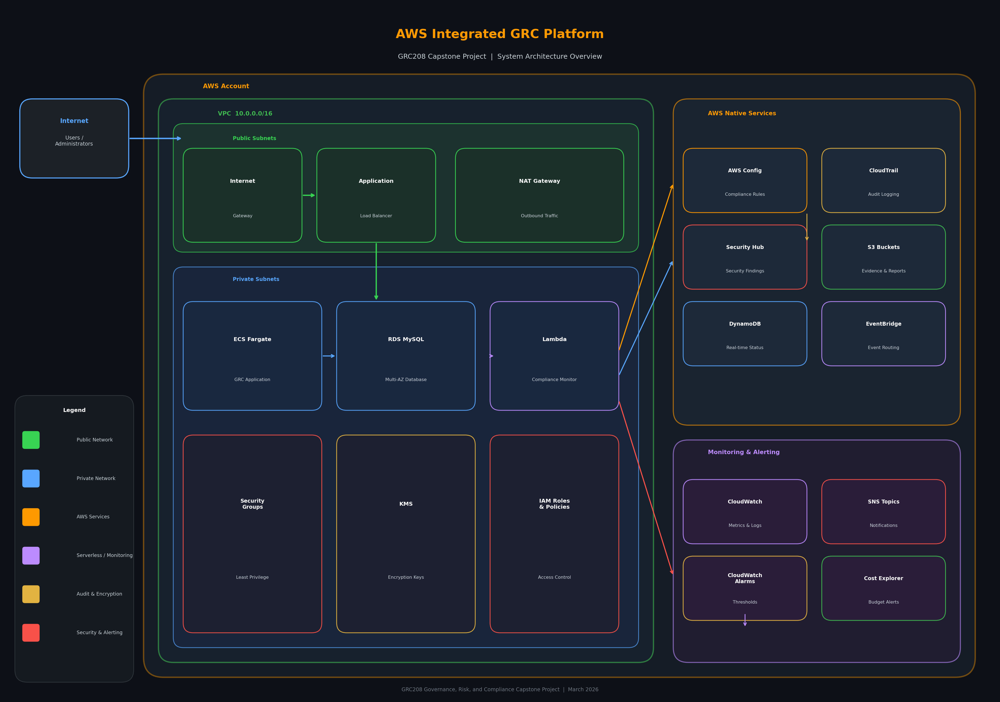
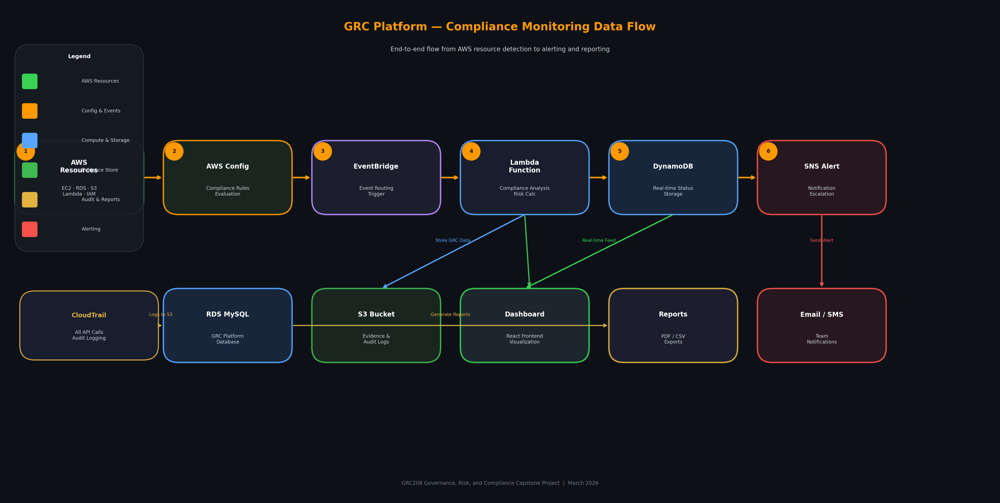
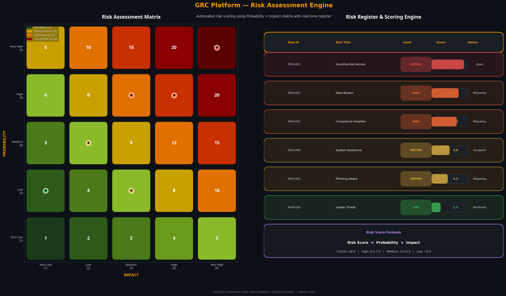
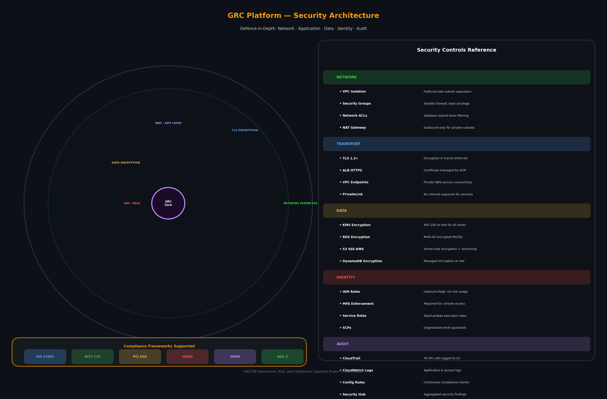
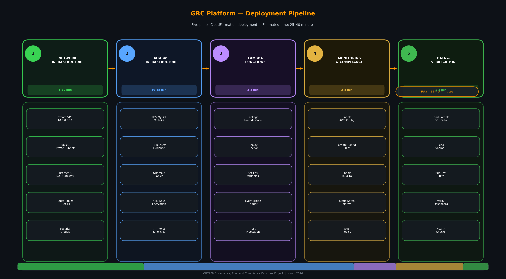
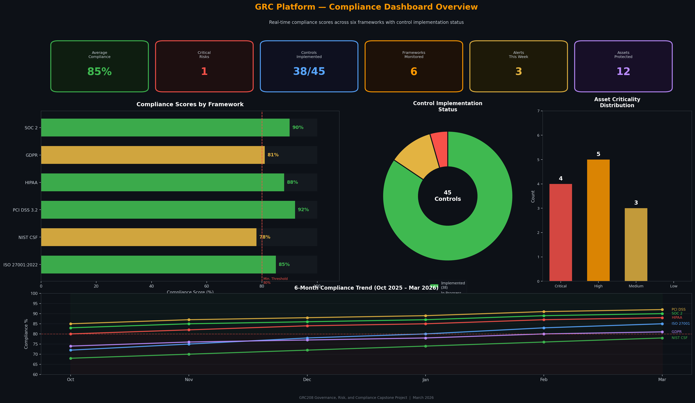

# GRC Platform Architecture Diagrams

This document contains the visual architecture diagrams for the AWS Integrated GRC Platform. These diagrams illustrate the system design, data flow, security layers, and deployment process.

## 1. System Architecture Overview

This diagram shows the complete AWS infrastructure, including the VPC layout, public/private subnets, core compute and database services, and the integration with AWS native security and monitoring services.

## 2. Compliance Monitoring Data Flow

This diagram illustrates the end-to-end data flow for compliance monitoring, from the initial detection of AWS resources to the evaluation of compliance rules, risk calculation, storage, and final alerting and reporting.

## 3. Risk Assessment Engine

This diagram visualizes the risk assessment methodology, featuring a 5x5 Probability vs. Impact matrix and the real-time risk register showing how individual risks are scored and tracked.

## 4. Security Architecture (Defence in Depth)

This diagram details the multi-layered security approach (Defence in Depth) implemented in the platform, covering network perimeter, transport encryption, application layer, data encryption, and identity/access management.

## 5. Deployment Pipeline

This diagram outlines the five-phase CloudFormation deployment process, showing the sequence of infrastructure creation, estimated times for each phase, and the specific components deployed in each step.

## 6. Compliance Dashboard Overview

This diagram provides a visual representation of the React frontend dashboard, showing key performance indicators, compliance scores across six frameworks, control implementation status, and compliance trends over time.

---
*GRC208 Governance, Risk, and Compliance Capstone Project | March 2026*
